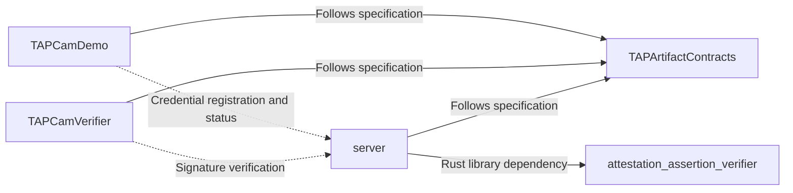

# TAP-NAP

Language：[English](https://github.com/TAP-NAP) | [简体中文](https://github.com/TAP-NAP/.github/blob/main/profile/README.zh-CN.md)

TAP-NAP provides tools for capturing, signing, and verifying media. Shared contracts connect the native camera, browser verifier, and App Attest service. Verification checks media bytes against their hashes and signatures, independently of decoding, playback, and depth analysis.

[Online Verifier](https://www.tapnap.net/verify/) · [Documentation](https://github.com/TAP-NAP/TAPArtifactContracts)

## Architecture

**Contracts are the single source of normative requirements.** Implementations depend on them in one direction. The standalone Rust library provides verification APIs used by the server.

## Repositories

| Repository | Purpose |
|---|---|
| [TAPArtifactContracts](https://github.com/TAP-NAP/TAPArtifactContracts) | Product requirements, media codecs, manifests, hashing, signatures, and service interfaces. |
| [TAPCamDemo](https://github.com/TAP-NAP/TAPCamDemo) | iPhone camera app with capture, signing, export, media browsing, and depth analysis. |
| [TAPCamVerifier](https://github.com/TAP-NAP/TAPCamVerifier) | Browser-based media hashing, signature verification requests, and media/depth inspection. |
| [server](https://github.com/TAP-NAP/server) | HTTP service for App Attest registration, Redis credential storage, and signature verification. |
| [attestation_assertion_verifier](https://github.com/TAP-NAP/attestation_assertion_verifier) | Rust library and command-line tools for Apple App Attest attestation and assertion verification. |

See each repository’s English or Chinese README for build instructions, usage, and directory structure.
