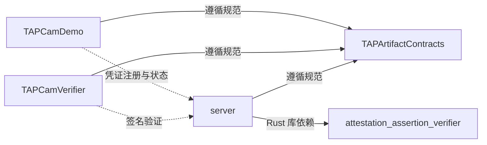

# TAP-NAP

中英文切换：[English](https://github.com/TAP-NAP) | [简体中文](https://github.com/TAP-NAP/.github/blob/main/profile/README.zh-CN.md)

TAP-NAP 提供影像采集、签名与验证工具。通过统一契约连接原生相机、浏览器验证器和 App Attest 服务，验证媒体字节与签名的一致性，并将媒体解码、播放和深度分析独立处理。

[在线验证](https://www.tapnap.net/verify/) · [协议文档](https://github.com/TAP-NAP/TAPArtifactContracts)

## 架构

**契约是唯一规范中心，文档依赖单向汇入契约。** 通用 Rust 库提供独立验证 API，由服务端集成。

## 仓库

| 仓库 | 职责 |
|---|---|
| [TAPArtifactContracts](https://github.com/TAP-NAP/TAPArtifactContracts) | 产品要求、媒体编码解码、manifest、哈希签名与服务接口。 |
| [TAPCamDemo](https://github.com/TAP-NAP/TAPCamDemo) | iPhone 相机：拍摄、签名、导出、图库及深度分析。 |
| [TAPCamVerifier](https://github.com/TAP-NAP/TAPCamVerifier) | 浏览器内重算媒体哈希、请求验签，并提供媒体与深度查看。 |
| [server](https://github.com/TAP-NAP/server) | App Attest 凭证注册、Redis 存储及签名验证 HTTP 服务。 |
| [attestation_assertion_verifier](https://github.com/TAP-NAP/attestation_assertion_verifier) | Apple App Attest attestation／assertion 验证库与命令行工具。 |

构建、运行和目录说明见各仓库的中英文 README。
